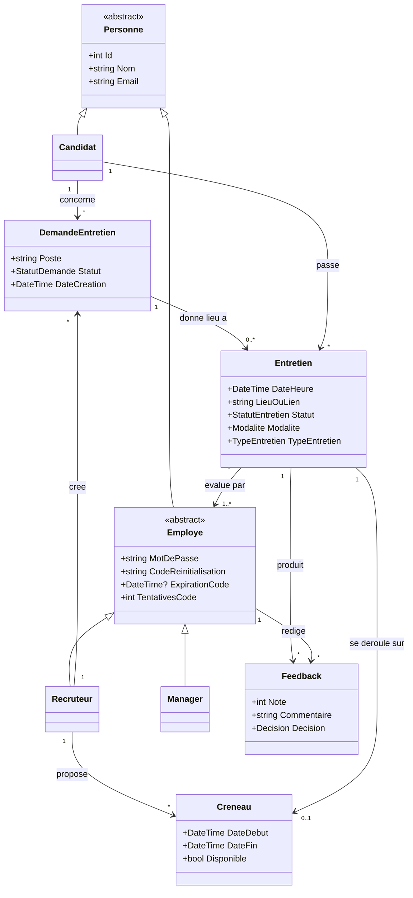

# Panel d'évaluateurs et tours d'entretien — conception

**Date :** 2026-07-30
**Module :** Gestion d'entretiens (un module du projet global « Gestion de recrutement »)
**Statut :** validé, prêt pour implémentation

---

## 1. Contexte et périmètre

Le projet global est une **gestion de recrutement** découpée en modules. Ce dépôt couvre
uniquement le module **gestion d'entretiens**. La frontière :

| Ce qui vient d'un autre module | Ce que ce module possède |
|---|---|
| Le poste à pourvoir (simple `string` sur la demande) | La demande d'entretien |
| Le candidat | Les disponibilités et les créneaux |
| La décision de faire passer un entretien | La planification et le déroulé |
| | Les participants à l'entretien |
| | Les comptes-rendus |

La création du besoin de recrutement (côté manager) et la gestion des postes sont **hors
périmètre** : elles appartiennent à d'autres modules.

## 2. Problème

Trois constats, vérifiés dans le code actuel.

### 2.1 Un entretien ne peut avoir qu'un seul évaluateur

`Entretien` porte une clé étrangère unique `RecruteurId` (`Models/Entretien.cs:22`), commentée
« animé par 1 recruteur ». En parallèle, `Manager` est une **classe vide**
(`Models/Manager.cs`) : elle n'a aucun lien vers un entretien.

Le modèle affirme donc que le RH mène l'entretien seul, et que le manager rédige un avis sur
un entretien auquel il n'a pas pu assister. Dans la réalité, un entretien de recrutement
réunit un panel : le RH, un ou des managers, éventuellement un évaluateur technique.

### 2.2 Le modèle se contredit sur les tours

L'enum `TypeEntretien` contient `RH`, `Technique`, `Managerial` — les trois tours d'un
processus de recrutement réel. Mais la cardinalité `DemandeEntretien → Entretien` est **1-1**,
imposée par un garde-fou explicite :

```csharp
// PlanificationService.cs:109
if (_db.Entretiens.Any(e => e.DemandeEntretienId == demandeId))
    throw new InvalidOperationException("Un entretien existe déjà pour cette demande.");
```

Le modèle nomme trois tours et n'en autorise qu'un seul. Ces deux points sont liés : **le
panel change à chaque tour** (préqualif = RH seul, technique = un ou deux évaluateurs, final =
manager + RH). Un panel variable n'a de sens que s'il y a plusieurs tours, et inversement.

### 2.3 Un niveau manque dans la hiérarchie `Personne`

Le test `personne is Recruteur || personne is Manager` est répété **4 fois** :
`AuthService.cs:50`, `:73`, `:103` et `FeedbackService.cs:32`.

`Personne.MotDePasse` porte le commentaire « null pour les candidats », de même que les trois
champs de réinitialisation par OTP. Des champs qui ne s'appliquent qu'à une partie des
sous-classes signalent un niveau d'héritage manquant.

## 3. Décisions

### D1 — Introduire une classe abstraite `Employe`

```
Personne (abstraite) ── Id, Nom, Email
├── Candidat
└── Employe (abstraite) ── MotDePasse, CodeReinitialisation, ExpirationCode, TentativesCode
    ├── Recruteur
    └── Manager
```

Justification :

- Les quatre champs d'authentification descendent sur `Employe` : plus aucun champ
  « null pour les candidats ».
- Les quatre tests de 2.3 deviennent `personne is Employe`.
- Le panel peut être typé `ICollection<Employe>` : **un candidat ne peut pas évaluer un
  entretien, le typage l'interdit** — ce n'est plus une vérification à l'exécution.

Impact base de données : **nul**. Le mapping est en Table-Per-Hierarchy, tout est déjà dans la
table `Personnes`. `Employe` est abstraite, elle n'a pas de valeur de discriminant propre.

*Alternative écartée :* typer le panel `ICollection<Personne>` avec une vérification manuelle
dans le service. Fonctionne, mais conserve les quatre `if` et n'empêche pas structurellement
d'ajouter un candidat au panel.

### D2 — Le panel : association N-N `Entretien` ↔ `Employe`

```csharp
public class Entretien
{
    /// <summary>Évaluateurs présents : RH et/ou managers (1..n).</summary>
    public virtual ICollection<Employe> Evaluateurs { get; set; }
}

public class Employe : Personne
{
    /// <summary>Les entretiens où il siège comme évaluateur.</summary>
    public virtual ICollection<Entretien> Entretiens { get; set; }
}
```

EF Core génère la table de jointure automatiquement : aucune classe d'association à écrire.

### D3 — Les tours : `DemandeEntretien → Entretien` passe en 1-n

- `DemandeEntretien.Entretiens` devient une collection.
- Le garde-fou de `PlanificationService.cs:109` est supprimé.
- **`TypeEntretien` est déplacé** de `DemandeEntretien` vers `Entretien` : le type qualifie le
  *tour*, pas la demande. Une demande enchaîne plusieurs tours de types différents.
- L'ordre des tours découle des `DateHeure`. Pas de colonne `NumeroTour` : elle serait
  redondante avec la date.

Cette décision **remplace** celle du 2026-07-10 (« une demande = un seul entretien, pas de
multi-tours »), qui était incompatible avec l'enum `TypeEntretien` du même modèle.

### D4 — Supprimer `Entretien.RecruteurId`

Ce champ n'est qu'une recopie de `demande.RecruteurId` :

```csharp
// PlanificationService.cs:119
var entretien = new Entretien { ..., RecruteurId = demande.RecruteurId };
```

L'organisateur reste accessible par `entretien.DemandeEntretien.Recruteur`. On supprime une
clé étrangère, une colonne, et tout risque de désynchronisation entre les deux valeurs.

`Recruteur.Entretiens` disparaît au profit de `Employe.Entretiens`, dont le sens est plus
juste : « les entretiens où il évalue ».

## 4. Modèle cible



Changements par rapport au diagramme précédent :

| Élément | Avant | Après |
|---|---|---|
| Hiérarchie | `Personne → {Candidat, Recruteur, Manager}` | `Personne → {Candidat, Employe → {Recruteur, Manager}}` |
| Demande → Entretien | 1-1 | 1-n (0 tant qu'elle n'est pas planifiée) |
| Entretien → évaluateur | 1 `Recruteur` | N-N vers `Employe` (1..n) |
| `TypeEntretien` | sur `DemandeEntretien` | sur `Entretien` |
| `Feedback.Auteur` | `Personne` | `Employe` |

## 5. Règles métier

| # | Règle | Où |
|---|---|---|
| R1 | Un entretien ne peut être planifié sans au moins un évaluateur | `PlanificationService.PlanifierEntretien` |
| R2 | Seul un évaluateur **présent à l'entretien** peut saisir un compte-rendu | `FeedbackService.SaisirFeedback` |
| R3 | Une demande annulée ne peut plus donner lieu à un entretien | existant, inchangé |
| R4 | Un créneau déjà réservé ne peut pas être repris | existant, inchangé |
| R5 | La note d'un feedback est comprise entre 0 et 5 | existant, inchangé |

R2 est le bénéfice principal du panel. Aujourd'hui, `FeedbackService.cs:32` vérifie seulement
que l'auteur est un RH ou un manager : **n'importe lequel de l'entreprise** peut noter
n'importe quel entretien. Après :

```csharp
if (!entretien.Evaluateurs.Any(e => e.Id == auteurId))
    throw new InvalidOperationException(
        "Seul un évaluateur présent à l'entretien peut saisir un compte-rendu.");
```

## 6. Impact sur le code

| Fichier | Changement |
|---|---|
| `Models/Employe.cs` | **nouveau** — classe abstraite, champs d'auth, `Entretiens` |
| `Models/Personne.cs` | les 4 champs d'auth descendent vers `Employe` |
| `Models/Recruteur.cs` | hérite d'`Employe` ; `Entretiens` supprimé (remonté) |
| `Models/Manager.cs` | hérite d'`Employe` |
| `Models/Entretien.cs` | `+ Evaluateurs`, `+ TypeEntretien`, `− RecruteurId/Recruteur` |
| `Models/DemandeEntretien.cs` | `+ Entretiens`, `− TypeEntretien` |
| `Models/Feedback.cs` | `Auteur` typé `Employe` |
| `Data/AppDbContext.cs` | entité `Employe`, relation N-N, suppression de `Entretien → Recruteur` |
| `Services/PlanificationService.cs` | signature de `PlanifierEntretien` (+ type, + évaluateurs) ; suppression du garde-fou 1-1 |
| `Services/FeedbackService.cs` | R2 remplace le test de type |
| `Services/AuthService.cs` | `is Employe` × 3 |
| `Services/Dtos/PlanificationDtos.cs` | `EntretienDto` : `RecruteurId` → `EvaluateurIds` + `TypeEntretien` ; `CreateDemandeRequest` − `TypeEntretien` ; requête de planification + type + évaluateurs |
| `Services/Mapping/DtoMappings.cs` | mapping des évaluateurs |
| Migration | **une seule** : table de jointure, colonne `TypeEntretien` déplacée, `RecruteurId` supprimé de `Entretiens` |

**Le contrat d'authentification donné au front ne change pas** : les trois endpoints
(`login`, `mot-de-passe-oublie`, `reinitialiser`) gardent la même signature et les mêmes
réponses.

## 7. Hors périmètre (limites assumées)

- **Les créneaux restent proposés par le RH seul** (`Creneau.RecruteurId` inchangé). Croiser
  les disponibilités de tout un panel est un problème de planification à part entière, hors
  sujet ici — et le RH qui coordonne les agendas correspond à la pratique réelle.
- **Pas de décision de synthèse au niveau de la demande.** La synthèse reste la lecture des
  `Feedback` de chaque tour. `StatutDemande.Terminee` suffit à clôturer.
- **Pas de numéro de tour explicite.** L'ordre découle des dates.
- **L'origine du besoin de recrutement** (le manager qui ouvre un poste) appartient à un autre
  module du projet global.

## 8. Vérification

Test manuel de bout en bout, dans cet ordre :

1. Créer une demande (RH + candidat + poste).
2. Définir des créneaux, en réserver un.
3. Planifier un **tour 1** de type `RH` avec un seul évaluateur (le RH) → succès.
4. Planifier un **tour 2** de type `Technique` sur la même demande avec deux évaluateurs
   → succès, **c'est ce que l'ancien modèle interdisait**.
5. Tenter une planification **sans évaluateur** → refus (R1).
6. Saisir un feedback par un évaluateur du tour 2 → succès.
7. Saisir un feedback par un manager **absent** du tour 2 → refus (R2).
8. Vérifier que `GET /api/entretiens` renvoie bien deux entretiens pour la demande, avec leurs
   types et leurs listes d'évaluateurs.
